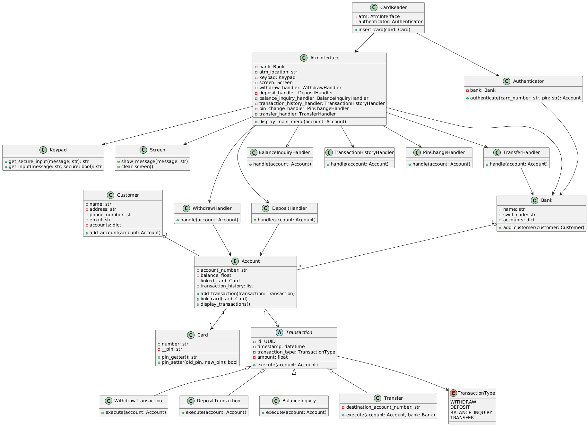

# 🏧 ATM System (OOP Project in Python)

This project is an **ATM simulation system** built using **Object-Oriented Programming (OOP)** principles and some **Software Engineering & Object-Oriented Design (OOD) concepts**.  
It demonstrates modular design, class interactions, and transaction handling in a banking environment.

---

## 📌 Project Overview
The system allows customers to interact with a simulated ATM.  
Each account is linked to a card and can perform multiple transactions including deposits, withdrawals, transfers, and balance inquiries.

---

## 🛠 Features
- **Account Management**: Balance tracking and transaction history.  
- **Authentication**: PIN-protected card system.  
- **ATM Operations**:
  - Withdraw money  
  - Deposit money  
  - Balance inquiry  
  - Transaction history view  
  - Change PIN  
  - Transfer money between accounts  
- **Customer & Bank**:
  - Bank manages accounts
  - Customers can hold multiple accounts  

---


## 📐 UML Class Diagram
The following diagram shows the structure and relationships between major classes in the system:



---

## ⚙️ Technologies Used
- **Python 3.x**
- **Pycharm**
- **OOP Concepts** (Encapsulation, Inheritance, Abstraction, Polymorphism)
- **SE & OOD Principles**
- **Exception Handling** for robust user interaction  
- **Unit Testing**
- **AI for documentation**

---

## 📖 Some of the applied Principles

    - Object-Oriented Programming (OOP) principles form the core of the project design.
    
    - Single Responsibility Principle (SRP) → Each class handles one clear function.
    
    - Encapsulation → Private attributes (e.g., PIN).
    
    - Abstraction → Transaction is an abstract base class that defines a common structure for all transaction types.
    
    - Polymorphism → Subclasses like WithdrawTransaction and DepositTransaction override the execute() method to provide specific behavior.

    - Open/Closed Principle → New transaction types can be added without altering existing core logic.

    - Object-Oriented Design (OOD) → Classes and relationships are structured for clarity, reusability, and flexibility.

    - Software Engineering (SE) practices → The project follows modular design and clean code conventions for maintainability and scalability.

---

## 🚀 How to Run

1. Clone the repository:
   ```bash
   git clone https://github.com/your-username/AtmSystemOOP.git
   cd AtmSystemOOP
   
2. Run the ATM program:
    python main.py

---

## 🧪 Running Tests

We use pytest for testing. 
To run tests write this in terminal:
    pytest

Expected output:
    collected 13 items
    .............   [100%]

---


## 📂 Project Structure
    
    AtmSystemOOP/
    ├── Account.py
    ├── AtmInterface.py
    ├── Authenticator.py
    ├── Bank.py
    ├── Card.py
    ├── CardReader.py
    ├── Customer.py
    ├── Handlers.py
    ├── Keypad.py
    ├── Screen.py
    ├── Transactions.py
    ├── main.py
    │-- AtmUml.png
    ├── test_all.py
    ├── README.md
    └── requirements.txt

---

## ⚙️ Requirements
    Python 3.10+

    pytest (for running tests)
    
    Install dependencies:
        pip install -r requirements.txt

---

## ✨ Example Workflow

    1. Insert card
    2. Enter PIN
    
    3. Choose from ATM menu:
        -Withdraw money
        -Deposit money
        -View balance
        -Transfer funds
        -Change PIN
        -Exit

---

📌 Potential Improvements

  - Add database integration (SQLite / MySQL) for persistent accounts

  - Add authentication system with PIN encryption

  - Expand to include transaction history export (CSV/Excel)

---

## 👨‍💻 Author

Developed by Anas Mohamed
Computer Science student @ AAST (Arab Academy for Science, Technology & Maritime Transport).

- GitHub: [anasmohamed05221](https://github.com/anasmohamed05221)  
- LinkedIn: [Anas Aly](https://www.linkedin.com/in/anas-aly-5a6a86337/)

---

## 📄 License
This project is licensed under the **MIT License** – feel free to use, modify, and share.  

---

⭐ If you like this project, consider giving it a star on GitHub!

